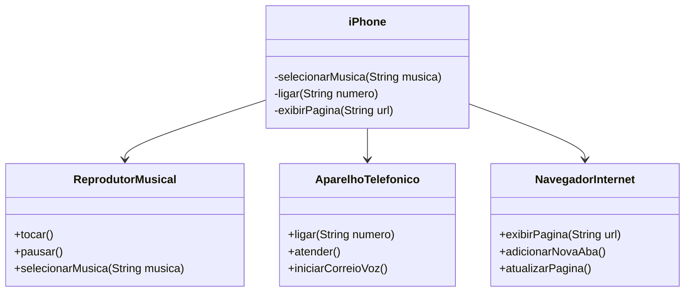

# Projeto-DIO-Iphone-UML
Repositorio para realização do desafio DIO de diagramação de um Iphone com UML

## Diagrama UML Iphone

```mermaid
classDiagram
    class iPhone {
        -selecionarMusica(String musica)
        -ligar(String numero)
        -exibirPagina(String url)
    }

    class ReprodutorMusical {
        +tocar()
        +pausar()
        +selecionarMusica(String musica)
    }

    class AparelhoTelefonico {
        +ligar(String numero)
        +atender()
        +iniciarCorreioVoz()
    }

    class NavegadorInternet {
        +exibirPagina(String url)
        +adicionarNovaAba()
        +atualizarPagina()
    }

    iPhone --> ReprodutorMusical
    iPhone --> AparelhoTelefonico
    iPhone --> NavegadorInternet

```
